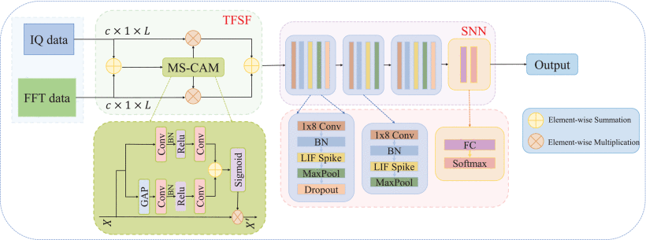
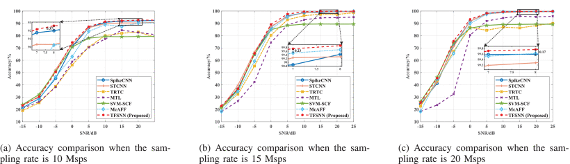
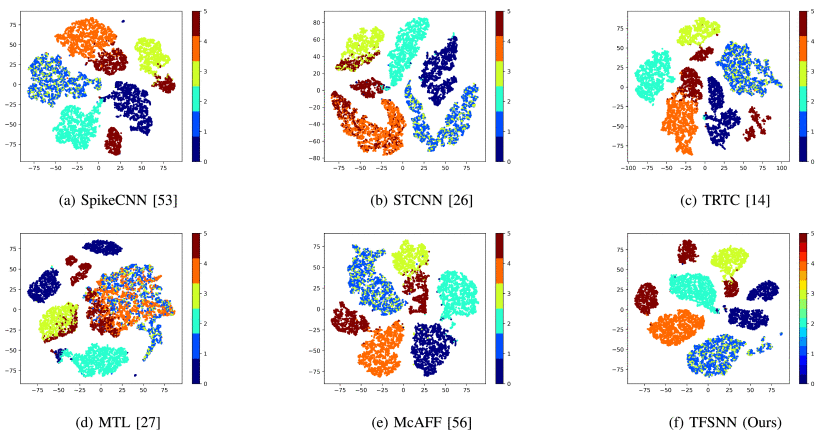

# TFSNN：Energy-Efficient Wireless Technology Recognition Method Using Time-Frequency Feature Fusion Spiking Neural Networks
This repository contains the official implementation of our [TFSNN](https://ieeexplore.ieee.org/document/10876404).
## Paper
L. Hu, Y. Wang, X. Fu, L. Guo, Y. Lin and G. Gui, "Energy-Efficient Wireless Technology Recognition Method Using Time-Frequency Feature Fusion Spiking Neural Networks," in IEEE Transactions on Information Forensics and Security, vol. 20, pp. 2252-2265, 2025, doi: 10.1109/TIFS.2025.3539519. 

### Abstract
Wireless Technology Recognition (WTR) distinguishes different wireless technologies by analyzing characteristic features extracted from radio signals. While deep learning (DL)-based methods are extensively used in WTR due to their ability to extract hidden data features and make accurate classification decisions, their application is often limited by excessive power consumption. In this paper, we propose a novel WTR method that addresses this challenge using a time-frequency feature fusion spiking neural networks (TFSNN) framework. Our approach combines information from both the time and frequency domains to enhance feature extraction. Experimental results demonstrate that our model performs exceptionally well at high signal-to-noise ratios on open-source datasets. Specifically, at a sampling rate of 15 Msps, our method achieves a recognition accuracy of 99.85%. Even when the sampling rate is reduced to 10 Msps, the average accuracy remains 1.61% higher than the best existing method. Additionally, our method reduces energy consumption by about half compared to most current methods. These results emphasize the effectiveness and necessity of time-frequency domain feature fusion (TFSF) in WTR.

### Proposed Method


### Performance
#### Identification accuracy
Sampling rate: 10Msps, 15Msps, 20Msps

#### Feature Visualization
Sampling rate: 10Msps SNR: 20dB


## Citation

If you find our work useful, please consider citing:

```bibtex
@article{hu2025energy,
  title={Energy-Efficient Wireless Technology Recognition Method Using Time-Frequency Feature Fusion Spiking Neural Networks},
  author={Hu, Lifan and Wang, Yu and Fu, Xue and Guo, Lantu and Lin, Yun and Gui, Guan},
  journal={IEEE Transactions on Information Forensics and Security},
  year={2025},
  publisher={IEEE}
}

## License / 许可证
本项目基于自定义非商业许可证发布，禁止用于任何形式的商业用途。
This project is distributed under a custom non-commercial license. Any form of commercial use is prohibited.

